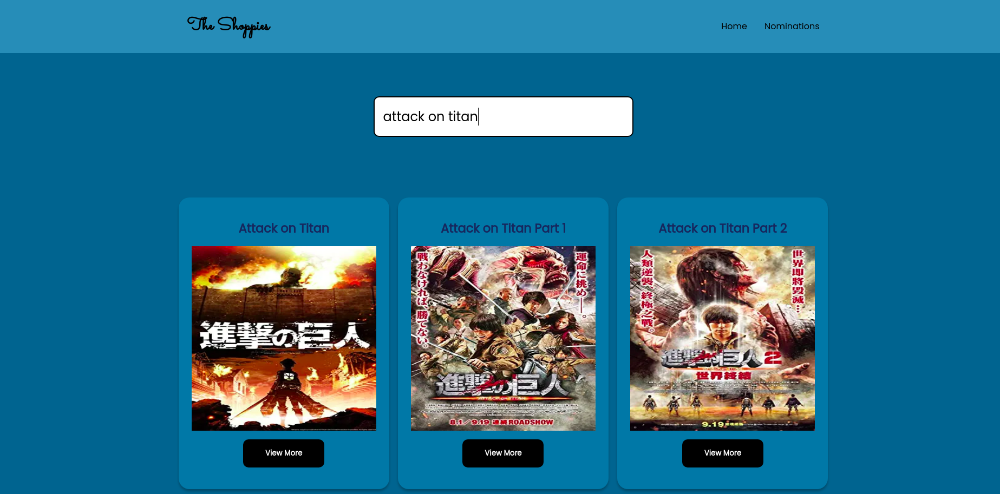
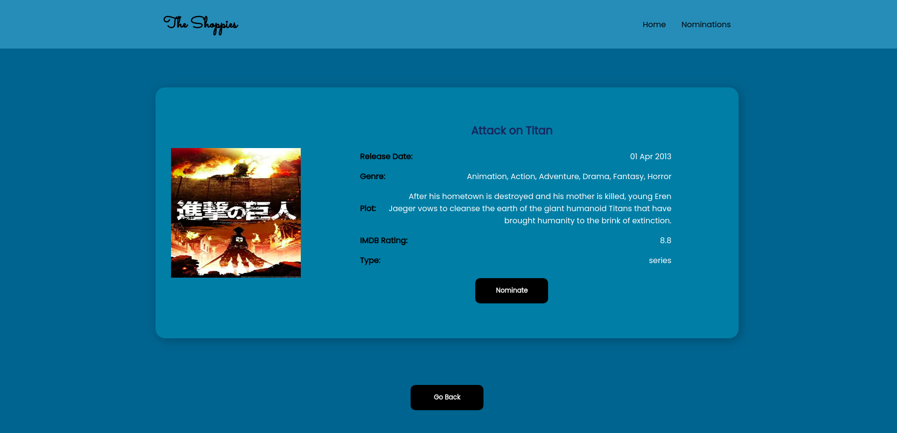

# The Shoppies

Search for movies and shows and add them to your nominations for the next Shoppies!

## Features

1. Search for movies and shows.
2. List movie data and nominate 5 of them.
3. Uses the OMDB API to fetch data for movies and shows. ( http://www.omdbapi.com/ )
4. Stores user's nominations in cookies in the browser.

## Built with

1. <a href='https://nextjs.org/'>next.js v10 with react v17</a>: Routing made much easier with Next.js and also image optimization provided by next/image.
2. <a href='https://reactjs.org/docs/context.html'>Context API</a>: Used in state management for nominations which is built in React.
3. <a href='https://www.npmjs.com/package/react-spinners'>react-spinners</a>: For loading animations
4. <a href='https://www.npmjs.com/package/js-cookie'>js-cookie</a>: To store the user's nominations in cookies.

## Screenshots

Home page

Movie page

## To Run

1. Clone into repo
2. Run `npm install`
3. Run `touch .env` to create a file for your environment variables. Necessary variables are API_KEY and NEXT_PUBLIC_API_KEY to store your API key.
4. Get your API key from http://www.omdbapi.com/
5. Run `npm run dev`
